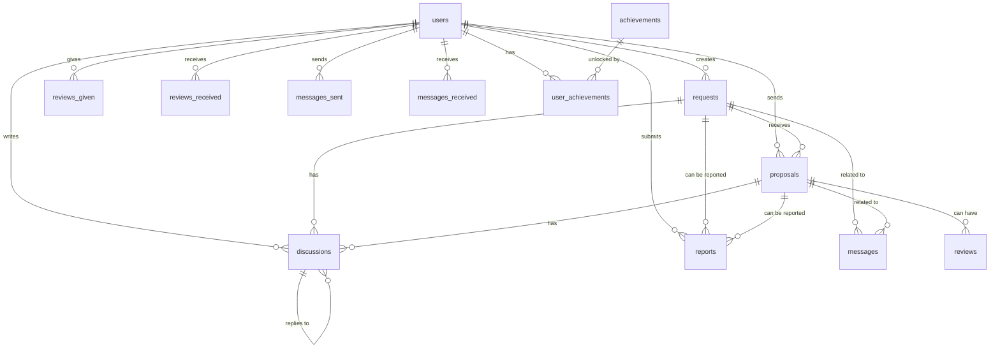
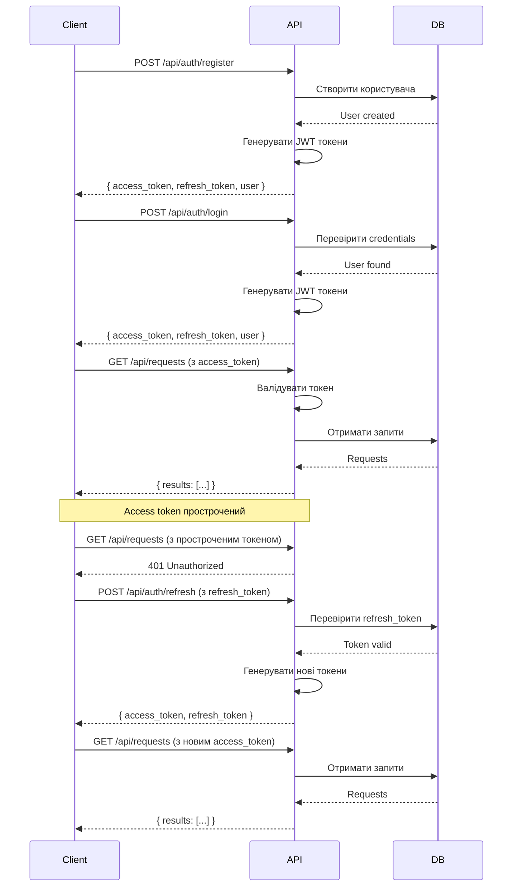
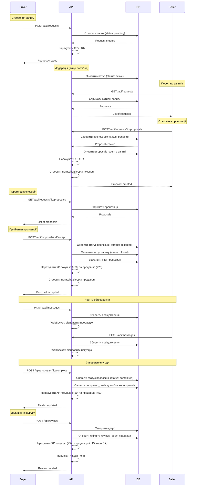

# Документація Backend API для проєкту Hochu

## Зміст

1. [Загальний опис проєкту](#загальний-опис-проєкту)
2. [Сутності та їх взаємодії](#сутності-та-їх-взаємодії)
3. [Опис сторінок та необхідних даних](#опис-сторінок-та-необхідних-даних)
4. [API Endpoints](#api-endpoints)
5. [Структура бази даних](#структура-бази-даних)
6. [Аутентифікація та авторизація](#аутентифікація-та-авторизація)
7. [Файли та зображення](#файли-та-зображення)
8. [Гейміфікація](#гейміфікація)
9. [Чат та повідомлення](#чат-та-повідомлення)
10. [Додаткові функції](#додаткові-функції)

---

## Загальний опис проєкту

### Назва та призначення

**Hochu** — це маркетплейс послуг (фріланс платформа), який з'єднує покупців (замовників) з продавцями (виконавцями).

### Основна ідея

Платформа працює за принципом зворотного аукціону:

- **Покупці** створюють запити (requests) на послуги, описуючи що їм потрібно, бюджет та інші вимоги
- **Продавці** переглядають запити та надсилають пропозиції (proposals) з ціною, термінами виконання та описом послуги
- Покупці обирають найкращу пропозицію та співпрацюють з продавцем

### Технології фронтенду

- **Next.js 15** з App Router
- **React 19** з TypeScript
- **React Query** для кешування та управління серверним станом
- **Zod** для валідації даних
- **Feature-Sliced Design (FSD)** архітектура

### Архітектура фронтенду

Проєкт використовує Feature-Sliced Design з наступними шарами:

- `app/` - ініціалізація, провайдери, роутинг
- `pages/` - сторінки додатку
- `widgets/` - складні композитні компоненти
- `features/` - бізнес-функціональність
- `entities/` - бізнес-сутності з API
- `shared/` - переіспользувані компоненти та утиліти

---

## Сутності та їх взаємодії

### Основні сутності

#### 1. User (Користувач)

Користувачі платформи можуть бути:

- **Buyer** (покупець/замовник) - створює запити на послуги
- **Seller** (продавець/виконавець) - надсилає пропозиції на запити
- **Admin** (адміністратор) - модерує контент та управляє платформою

**Поля:**

- `id` - унікальний ідентифікатор
- `name` - ім'я користувача
- `email` - email адреса (унікальна)
- `password` - хеш пароля
- `avatar` - URL аватара
- `role` - роль (buyer, seller, admin)
- `rating` - середній рейтинг (0-5)
- `reviewsCount` - кількість відгуків
- `isVerified` - чи верифікований користувач
- `memberSince` - дата реєстрації
- `completedDeals` - кількість завершених угод
- `location` - локація користувача
- `xp` - досвід (experience points) для гейміфікації
- `unlockedAchievements` - масив ID розблокованих досягнень
- `topAchievements` - масив ID топ досягнень для відображення
- `isBlocked` - чи заблокований користувач
- `blockedUntil` - дата до якої заблокований (якщо тимчасово)
- `createdAt` - дата створення
- `updatedAt` - дата оновлення

#### 2. Request (Запит)

Запит на послугу від покупця.

**Поля:**

- `id` - унікальний ідентифікатор
- `title` - заголовок запиту
- `description` - детальний опис
- `category` - категорія (Електроніка, Дизайн, Освіта, тощо)
- `budgetMin` - мінімальний бюджет (грн)
- `budgetMax` - максимальний бюджет (грн)
- `location` - локація (місто або "Віддалено")
- `urgency` - терміновість (Гнучко, Протягом тижня, 2-3 дні, Терміново)
- `buyerId` - ID покупця (foreign key до User)
- `images` - масив URL зображень
- `views` - кількість переглядів
- `proposalsCount` - кількість пропозицій
- `status` - статус (pending, active, closed, rejected)
- `edits` - масив історії редагувань (текст, timestamp)
- `createdAt` - дата створення
- `updatedAt` - дата оновлення

#### 3. Proposal (Пропозиція)

Пропозиція від продавця на запит покупця.

**Поля:**

- `id` - унікальний ідентифікатор
- `requestId` - ID запиту (foreign key до Request)
- `sellerId` - ID продавця (foreign key до User)
- `price` - запропонована ціна (грн)
- `title` - заголовок пропозиції
- `description` - детальний опис послуги
- `estimatedTime` - термін виконання (1-2 дні, тиждень, тощо)
- `warranty` - гарантія (1 місяць, 3 місяці, тощо)
- `images` - масив URL зображень робіт продавця
- `status` - статус (pending, accepted, rejected, completed)
- `createdAt` - дата створення
- `updatedAt` - дата оновлення

#### 4. Review (Відгук)

Відгук між користувачами після завершення угоди.

**Поля:**

- `id` - унікальний ідентифікатор
- `userId` - ID користувача, який залишив відгук (foreign key до User)
- `targetUserId` - ID користувача, про якого відгук (foreign key до User)
- `requestId` - ID запиту (foreign key до Request, опціонально)
- `proposalId` - ID пропозиції (foreign key до Proposal, опціонально)
- `rating` - оцінка (1-5)
- `comment` - текст відгуку
- `createdAt` - дата створення
- `updatedAt` - дата оновлення

#### 5. Message (Повідомлення)

Повідомлення в чаті між користувачами.

**Поля:**

- `id` - унікальний ідентифікатор
- `senderId` - ID відправника (foreign key до User)
- `receiverId` - ID отримувача (foreign key до User)
- `requestId` - ID запиту, пов'язаного з чатом (foreign key до Request, опціонально)
- `proposalId` - ID пропозиції, пов'язаної з чатом (foreign key до Proposal, опціонально)
- `content` - текст повідомлення
- `read` - чи прочитано повідомлення
- `createdAt` - дата створення

#### 6. Discussion (Обговорення)

Публічні коментарі під запитом або пропозицією.

**Поля:**

- `id` - унікальний ідентифікатор
- `requestId` - ID запиту (foreign key до Request, опціонально)
- `proposalId` - ID пропозиції (foreign key до Proposal, опціонально)
- `userId` - ID користувача, який залишив коментар (foreign key до User)
- `replyToId` - ID коментаря, на який відповідають (foreign key до Discussion, опціонально)
- `content` - текст коментаря
- `createdAt` - дата створення
- `updatedAt` - дата оновлення

#### 7. BlogPost (Стаття блогу)

Статті в блозі платформи.

**Поля:**

- `id` - унікальний ідентифікатор
- `title` - заголовок статті
- `description` - короткий опис
- `content` - повний текст статті
- `category` - категорія статті
- `author` - автор статті
- `image` - URL зображення
- `readTime` - час читання (хвилини)
- `published` - чи опублікована стаття
- `createdAt` - дата створення
- `updatedAt` - дата оновлення

#### 8. Report (Скарга)

Скарги на контент або користувачів.

**Поля:**

- `id` - унікальний ідентифікатор
- `reporterId` - ID користувача, який подал скаргу (foreign key до User)
- `targetType` - тип об'єкта (request, proposal, user, discussion)
- `targetId` - ID об'єкта, на який скарга
- `reason` - причина скарги (low-price, scam, inappropriate, spam, duplicate, other)
- `details` - додаткові деталі
- `status` - статус (pending, reviewed, resolved, rejected)
- `createdAt` - дата створення
- `updatedAt` - дата оновлення

#### 9. Achievement (Досягнення)

Досягнення для гейміфікації.

**Поля:**

- `id` - унікальний ідентифікатор (string)
- `name` - назва досягнення
- `description` - опис
- `icon` - іконка (emoji або URL)
- `rarity` - рідкісність (common, rare, epic, legendary)
- `role` - для якої ролі (buyer, seller, both)
- `condition` - умова отримання (JSON)

#### 10. UserAchievement (Досягнення користувача)

Зв'язок між користувачем та досягненням.

**Поля:**

- `id` - унікальний ідентифікатор
- `userId` - ID користувача (foreign key до User)
- `achievementId` - ID досягнення (foreign key до Achievement)
- `unlockedAt` - дата отримання

### Діаграма взаємодії сутностей

```mermaid
erDiagram
    User ||--o{ Request : creates
    User ||--o{ Proposal : sends
    User ||--o{ Review : "gives/receives"
    User ||--o{ Message : "sends/receives"
    User ||--o{ Discussion : writes
    User ||--o{ Report : submits
    User ||--o{ UserAchievement : has

    Request ||--o{ Proposal : receives
    Request ||--o{ Discussion : has
    Request ||--o{ Report : "can be reported"

    Proposal ||--o{ Discussion : has
    Proposal ||--o{ Report : "can be reported"
    Proposal ||--o{ Review : "can have"

    Achievement ||--o{ UserAchievement : "unlocked by"

    Request {
        int id PK
        string title
        string description
        string category
        int budgetMin
        int budgetMax
        string location
        string urgency
        int buyerId FK
        array images
        int views
        int proposalsCount
        string status
    }

    Proposal {
        int id PK
        int requestId FK
        int sellerId FK
        int price
        string title
        string description
        string estimatedTime
        string warranty
        array images
        string status
    }

    User {
        int id PK
        string name
        string email
        string password
        string avatar
        string role
        float rating
        int reviewsCount
        boolean isVerified
        int completedDeals
        string location
        int xp
        boolean isBlocked
    }

    Review {
        int id PK
        int userId FK
        int targetUserId FK
        int requestId FK
        int proposalId FK
        int rating
        string comment
    }

    Message {
        int id PK
        int senderId FK
        int receiverId FK
        int requestId FK
        int proposalId FK
        string content
        boolean read
    }

    Discussion {
        int id PK
        int requestId FK
        int proposalId FK
        int userId FK
        int replyToId FK
        string content
    }

    Report {
        int id PK
        int reporterId FK
        string targetType
        int targetId
        string reason
        string details
        string status
    }

    Achievement {
        string id PK
        string name
        string description
        string icon
        string rarity
        string role
        json condition
    }

    UserAchievement {
        int id PK
        int userId FK
        string achievementId FK
        datetime unlockedAt
    }
```



---

## Опис сторінок та необхідних даних

### 1. Головна сторінка (`/`)

**Опис:** Лендінг сторінка з Hero секцією, Features, HowItWorks та Footer.

**Дані з бекенду:**

- Статистика платформи (опціонально, для динамічного відображення)

**API Endpoints:**

- `GET /api/stats` - статистика платформи
  - Response: `{ totalUsers: number, totalRequests: number, totalDeals: number, averageRating: number }`

---

### 2. Перегляд запитів (`/browse`)

**Опис:** Сторінка зі списком запитів, фільтрацією за категорією, локацією, бюджетом та пошуком.

**Дані з бекенду:**

- Список активних запитів з пагінацією
- Фільтри: категорія, локація, бюджет, пошук

**API Endpoints:**

- `GET /api/requests` - список запитів
  - Query параметри:
    - `category` (string, опціонально) - категорія
    - `search` (string, опціонально) - пошук по заголовку/опису
    - `location` (string, опціонально) - локація
    - `budgetMin` (number, опціонально) - мінімальний бюджет
    - `budgetMax` (number, опціонально) - максимальний бюджет
    - `page` (number, опціонально, default: 1) - номер сторінки
    - `pageSize` (number, опціонально, default: 20) - розмір сторінки
  - Response: `{ count: number, next: string | null, previous: string | null, results: Request[] }`

---

### 3. Створення запиту (`/create`)

**Опис:** Форма для створення нового запиту на послугу.

**Дані з бекенду:**

- Список категорій (може бути статичним на фронтенді)

**API Endpoints:**

- `POST /api/requests` - створення запиту
  - Headers: `Authorization: Bearer <access_token>`
  - Request Body:
    ```json
    {
      "title": "string (required, min 1)",
      "description": "string (required, min 10)",
      "category": "string (required)",
      "budgetMin": "number (required, min 0)",
      "budgetMax": "number (required, min 0)",
      "location": "string (required, min 1)",
      "urgency": "string (required)",
      "images": "string[] (optional)"
    }
    ```
  - Response: `Request` (створений запит)

---

### 4. Деталі запиту (`/request/[id]`)

**Опис:** Детальна сторінка запиту з:

- Інформацією про запит
- Списком пропозицій від продавців
- Публічними обговореннями
- Формою для створення пропозиції
- Інформацією про покупця
- Можливістю скарги

**Дані з бекенду:**

- Деталі запиту
- Інформація про покупця
- Список пропозицій до запиту
- Публічні обговорення
- Можливість створення пропозиції
- Можливість додавання коментаря
- Можливість скарги

**API Endpoints:**

- `GET /api/requests/:id` - деталі запиту
  - Response: `RequestWithBuyer` (запит з інформацією про покупця)

- `GET /api/requests/:id/proposals` - пропозиції до запиту
  - Query параметри:
    - `page` (number, опціонально)
    - `pageSize` (number, опціонально)
  - Response: `{ count: number, results: ProposalWithSeller[] }`

- `GET /api/requests/:id/discussions` - публічні обговорення
  - Response: `Discussion[]`

- `POST /api/requests/:id/proposals` - створення пропозиції
  - Headers: `Authorization: Bearer <access_token>`
  - Request Body:
    ```json
    {
      "price": "number (required, min 0)",
      "title": "string (required)",
      "description": "string (required)",
      "estimatedTime": "string (required)",
      "warranty": "string (required)",
      "images": "string[] (optional)"
    }
    ```
  - Response: `ProposalWithSeller`

- `POST /api/requests/:id/discussions` - додавання коментаря
  - Headers: `Authorization: Bearer <access_token>`
  - Request Body:
    ```json
    {
      "content": "string (required)",
      "replyToId": "number (optional)"
    }
    ```
  - Response: `Discussion`

- `POST /api/requests/:id/report` - скарга на запит
  - Headers: `Authorization: Bearer <access_token>`
  - Request Body:
    ```json
    {
      "reason": "string (required, enum: low-price, scam, inappropriate, spam, duplicate, other)",
      "details": "string (optional)"
    }
    ```
  - Response: `{ success: boolean, message: string }`

---

### 5. Деталі пропозиції (`/proposal/[id]`)

**Опис:** Детальна сторінка пропозиції з:

- Інформацією про пропозицію
- Інформацією про продавця
- Інформацією про покупця (оригінальний запит)
- Коментарями/обговоренням
- Відгуками про продавця
- Можливістю прийняття/відхилення пропозиції

**Дані з бекенду:**

- Деталі пропозиції
- Інформація про продавця
- Інформація про покупця та оригінальний запит
- Коментарі до пропозиції
- Відгуки про продавця

**API Endpoints:**

- `GET /api/proposals/:id` - деталі пропозиції
  - Response: `ProposalWithSeller` (пропозиція з інформацією про продавця та запит)

- `GET /api/proposals/:id/comments` - коментарі до пропозиції
  - Response: `Discussion[]`

- `POST /api/proposals/:id/accept` - прийняття пропозиції
  - Headers: `Authorization: Bearer <access_token>`
  - Response: `{ success: boolean, message: string }`

- `POST /api/proposals/:id/reject` - відхилення пропозиції
  - Headers: `Authorization: Bearer <access_token>`
  - Response: `{ success: boolean, message: string }`

- `POST /api/proposals/:id/comments` - додавання коментаря
  - Headers: `Authorization: Bearer <access_token>`
  - Request Body:
    ```json
    {
      "content": "string (required)",
      "replyToId": "number (optional)"
    }
    ```
  - Response: `Discussion`

---

### 6. Профіль користувача (`/profile`)

**Опис:** Профіль користувача з вкладками:

- Огляд (overview) - активні запити, останні угоди
- Досягнення (gamification) - XP, рівні, досягнення
- Аналітика (analytics) - статистика користувача
- Відгуки (reviews) - відгуки про користувача
- Повідомлення (messages) - чат з іншими користувачами
- Налаштування (settings) - редагування профілю

**Дані з бекенду:**

- Дані поточного користувача
- Запити користувача
- Пропозиції користувача
- Відгуки про користувача
- Статистика користувача
- Досягнення користувача

**API Endpoints:**

- `GET /api/users/me` - дані поточного користувача
  - Headers: `Authorization: Bearer <access_token>`
  - Response: `User`

- `GET /api/users/:id/requests` - запити користувача
  - Query параметри:
    - `status` (string, опціонально) - статус запитів
    - `page` (number, опціонально)
    - `pageSize` (number, опціонально)
  - Response: `{ count: number, results: Request[] }`

- `GET /api/users/:id/proposals` - пропозиції користувача
  - Query параметри:
    - `status` (string, опціонально) - статус пропозицій
    - `page` (number, опціонально)
    - `pageSize` (number, опціонально)
  - Response: `{ count: number, results: Proposal[] }`

- `GET /api/users/:id/reviews` - відгуки про користувача
  - Query параметри:
    - `page` (number, опціонально)
    - `pageSize` (number, опціонально)
  - Response: `{ count: number, results: Review[] }`

- `GET /api/users/:id/stats` - статистика користувача
  - Response:
    ```json
    {
      "totalRequests": "number",
      "totalProposals": "number",
      "acceptedProposals": "number",
      "completedDeals": "number",
      "averageRating": "number",
      "totalEarned": "number (для продавців)",
      "totalSpent": "number (для покупців)"
    }
    ```

- `GET /api/users/:id/achievements` - досягнення користувача
  - Response: `UserAchievement[]`

- `PATCH /api/users/me` - оновлення профілю
  - Headers: `Authorization: Bearer <access_token>`
  - Request Body:
    ```json
    {
      "name": "string (optional)",
      "avatar": "string (optional)",
      "location": "string (optional)"
    }
    ```
  - Response: `User`

---

### 7. Авторизація (`/login`, `/register`)

**Опис:** Сторінки входу та реєстрації.

**Дані з бекенду:**

- Вхід користувача
- Реєстрація нового користувача
- Оновлення токенів

**API Endpoints:**

- `POST /api/auth/register` - реєстрація
  - Request Body:
    ```json
    {
      "email": "string (required, email format)",
      "password": "string (required, min 6)",
      "name": "string (required, min 2)"
    }
    ```
  - Response: `AuthResponse` (access_token, refresh_token, user)

- `POST /api/auth/login` - вхід
  - Request Body:
    ```json
    {
      "email": "string (required)",
      "password": "string (required)"
    }
    ```
  - Response: `AuthResponse`

- `POST /api/auth/refresh` - оновлення токену
  - Request Body:
    ```json
    {
      "refresh_token": "string (required)"
    }
    ```
  - Response: `{ access_token: string, refresh_token: string }`

- `POST /api/auth/logout` - вихід
  - Headers: `Authorization: Bearer <access_token>`
  - Response: `{ success: boolean }`

---

### 8. Блог (`/blog`, `/blog/[id]`)

**Опис:** Список статей блогу та детальна сторінка статті.

**Дані з бекенду:**

- Список опублікованих статей
- Деталі статті

**API Endpoints:**

- `GET /api/blog/posts` - список статей
  - Query параметри:
    - `category` (string, опціонально) - категорія
    - `page` (number, опціонально)
    - `pageSize` (number, опціонально)
  - Response: `{ count: number, results: BlogPost[] }`

- `GET /api/blog/posts/:id` - деталі статті
  - Response: `BlogPost`

---

### 9. Адмін панель (`/admin`)

**Опис:** Адміністративна панель для модерації контенту та управління платформою.

**Дані з бекенду:**

- Статистика платформи
- Запити на модерацію
- Пропозиції на модерацію
- Користувачі зі скаргами
- Можливість затвердження/відхилення контенту
- Можливість блокування користувачів

**API Endpoints:**

- `GET /api/admin/analytics` - статистика платформи
  - Headers: `Authorization: Bearer <access_token>` (тільки для admin)
  - Response:
    ```json
    {
      "totalUsers": "number",
      "activeRequests": "number",
      "totalProposals": "number",
      "revenue": "number",
      "growth": "string",
      "usersByRole": {
        "buyers": "number",
        "sellers": "number"
      },
      "requestsByCategory": "object",
      "activityChart": "array"
    }
    ```

- `GET /api/admin/requests/pending` - запити на модерацію
  - Headers: `Authorization: Bearer <access_token>` (тільки для admin)
  - Query параметри:
    - `page` (number, опціонально)
    - `pageSize` (number, опціонально)
  - Response: `{ count: number, results: Request[] }`

- `POST /api/admin/requests/:id/approve` - затвердження запиту
  - Headers: `Authorization: Bearer <access_token>` (тільки для admin)
  - Response: `{ success: boolean, message: string }`

- `POST /api/admin/requests/:id/reject` - відхилення запиту
  - Headers: `Authorization: Bearer <access_token>` (тільки для admin)
  - Request Body:
    ```json
    {
      "reason": "string (required)"
    }
    ```
  - Response: `{ success: boolean, message: string }`

- `GET /api/admin/proposals/pending` - пропозиції на модерацію
  - Headers: `Authorization: Bearer <access_token>` (тільки для admin)
  - Query параметри:
    - `page` (number, опціонально)
    - `pageSize` (number, опціонально)
  - Response: `{ count: number, results: Proposal[] }`

- `POST /api/admin/proposals/:id/approve` - затвердження пропозиції
  - Headers: `Authorization: Bearer <access_token>` (тільки для admin)
  - Response: `{ success: boolean, message: string }`

- `POST /api/admin/proposals/:id/reject` - відхилення пропозиції
  - Headers: `Authorization: Bearer <access_token>` (тільки для admin)
  - Request Body:
    ```json
    {
      "reason": "string (required)"
    }
    ```
  - Response: `{ success: boolean, message: string }`

- `GET /api/admin/users/reported` - користувачі зі скаргами
  - Headers: `Authorization: Bearer <access_token>` (тільки для admin)
  - Query параметри:
    - `page` (number, опціонально)
    - `pageSize` (number, опціонально)
  - Response: `{ count: number, results: User[] }`

- `POST /api/admin/users/:id/block` - блокування користувача
  - Headers: `Authorization: Bearer <access_token>` (тільки для admin)
  - Request Body:
    ```json
    {
      "reason": "string (required)",
      "duration": "string (required, enum: 24h, 7d, 30d, permanent)"
    }
    ```
  - Response: `{ success: boolean, message: string }`

- `POST /api/admin/users/:id/unblock` - розблокування користувача
  - Headers: `Authorization: Bearer <access_token>` (тільки для admin)
  - Response: `{ success: boolean, message: string }`

---

### 10. Статичні сторінки

**Сторінки:** `/about`, `/contact`, `/how-it-works`, `/pricing`, `/terms`, `/privacy`, `/support`

**Опис:** Статичні інформаційні сторінки. Можуть бути статичними або з невеликою кількістю даних з бекенду.

**API Endpoints (опціонально):**

- `POST /api/contact` - відправка форми зворотного зв'язку
  - Request Body:
    ```json
    {
      "name": "string (required)",
      "email": "string (required, email)",
      "subject": "string (required)",
      "message": "string (required)"
    }
    ```
  - Response: `{ success: boolean, message: string }`

---

## API Endpoints

### Базовий URL

```
https://api.hochu.com/api
```

або для розробки:

```
http://localhost:3000/api
```

### Загальні принципи

1. **Аутентифікація:** Більшість endpoints вимагають JWT токен в заголовку `Authorization: Bearer <access_token>`
2. **Формат даних:** Всі запити та відповіді в форматі JSON
3. **Кодування:** UTF-8
4. **Пагінація:** Використовується для списків (page, pageSize)
5. **Сортування:** Можливе через query параметр `sort` (наприклад, `sort=-createdAt` для сортування за датою створення DESC)
6. **Фільтрація:** Через query параметри

### Коди відповідей

- `200 OK` - успішний запит
- `201 Created` - ресурс створено
- `400 Bad Request` - невалідні дані
- `401 Unauthorized` - не авторизовано
- `403 Forbidden` - недостатньо прав
- `404 Not Found` - ресурс не знайдено
- `422 Unprocessable Entity` - помилка валідації
- `500 Internal Server Error` - помилка сервера

### Формат помилок

```json
{
  "error": {
    "message": "string",
    "code": "string",
    "details": "object (optional)"
  }
}
```

---

## Структура бази даних

### ER-діаграма



### Таблиці

#### users

| Поле            | Тип                              | Обмеження                                             | Опис                       |
| --------------- | -------------------------------- | ----------------------------------------------------- | -------------------------- |
| id              | INT                              | PRIMARY KEY, AUTO_INCREMENT                           | Унікальний ідентифікатор   |
| name            | VARCHAR(255)                     | NOT NULL                                              | Ім'я користувача           |
| email           | VARCHAR(255)                     | NOT NULL, UNIQUE                                      | Email адреса               |
| password        | VARCHAR(255)                     | NOT NULL                                              | Хеш пароля                 |
| avatar          | VARCHAR(500)                     | NULL                                                  | URL аватара                |
| role            | ENUM('buyer', 'seller', 'admin') | NOT NULL, DEFAULT 'buyer'                             | Роль користувача           |
| rating          | DECIMAL(3,2)                     | DEFAULT 0.00                                          | Середній рейтинг (0-5)     |
| reviews_count   | INT                              | DEFAULT 0                                             | Кількість відгуків         |
| is_verified     | BOOLEAN                          | DEFAULT FALSE                                         | Чи верифікований           |
| member_since    | DATE                             | NOT NULL                                              | Дата реєстрації            |
| completed_deals | INT                              | DEFAULT 0                                             | Кількість завершених угод  |
| location        | VARCHAR(255)                     | NULL                                                  | Локація                    |
| xp              | INT                              | DEFAULT 0                                             | Досвід (experience points) |
| is_blocked      | BOOLEAN                          | DEFAULT FALSE                                         | Чи заблокований            |
| blocked_until   | DATETIME                         | NULL                                                  | Дата до якої заблокований  |
| created_at      | TIMESTAMP                        | DEFAULT CURRENT_TIMESTAMP                             | Дата створення             |
| updated_at      | TIMESTAMP                        | DEFAULT CURRENT_TIMESTAMP ON UPDATE CURRENT_TIMESTAMP | Дата оновлення             |

**Індекси:**

- `idx_email` на `email`
- `idx_role` на `role`
- `idx_rating` на `rating`

#### requests

| Поле            | Тип                                             | Обмеження                                             | Опис                     |
| --------------- | ----------------------------------------------- | ----------------------------------------------------- | ------------------------ |
| id              | INT                                             | PRIMARY KEY, AUTO_INCREMENT                           | Унікальний ідентифікатор |
| title           | VARCHAR(255)                                    | NOT NULL                                              | Заголовок запиту         |
| description     | TEXT                                            | NOT NULL                                              | Детальний опис           |
| category        | VARCHAR(100)                                    | NOT NULL                                              | Категорія                |
| budget_min      | DECIMAL(10,2)                                   | NOT NULL                                              | Мінімальний бюджет       |
| budget_max      | DECIMAL(10,2)                                   | NOT NULL                                              | Максимальний бюджет      |
| location        | VARCHAR(255)                                    | NOT NULL                                              | Локація                  |
| urgency         | VARCHAR(50)                                     | NOT NULL                                              | Терміновість             |
| buyer_id        | INT                                             | NOT NULL, FOREIGN KEY                                 | ID покупця               |
| images          | JSON                                            | NULL                                                  | Масив URL зображень      |
| views           | INT                                             | DEFAULT 0                                             | Кількість переглядів     |
| proposals_count | INT                                             | DEFAULT 0                                             | Кількість пропозицій     |
| status          | ENUM('pending', 'active', 'closed', 'rejected') | DEFAULT 'pending'                                     | Статус                   |
| edits           | JSON                                            | NULL                                                  | Історія редагувань       |
| created_at      | TIMESTAMP                                       | DEFAULT CURRENT_TIMESTAMP                             | Дата створення           |
| updated_at      | TIMESTAMP                                       | DEFAULT CURRENT_TIMESTAMP ON UPDATE CURRENT_TIMESTAMP | Дата оновлення           |

**Індекси:**

- `idx_buyer_id` на `buyer_id`
- `idx_category` на `category`
- `idx_status` на `status`
- `idx_created_at` на `created_at`
- `FULLTEXT idx_search` на `title`, `description`

#### proposals

| Поле           | Тип                                                  | Обмеження                                             | Опис                     |
| -------------- | ---------------------------------------------------- | ----------------------------------------------------- | ------------------------ |
| id             | INT                                                  | PRIMARY KEY, AUTO_INCREMENT                           | Унікальний ідентифікатор |
| request_id     | INT                                                  | NOT NULL, FOREIGN KEY                                 | ID запиту                |
| seller_id      | INT                                                  | NOT NULL, FOREIGN KEY                                 | ID продавця              |
| price          | DECIMAL(10,2)                                        | NOT NULL                                              | Запропонована ціна       |
| title          | VARCHAR(255)                                         | NOT NULL                                              | Заголовок пропозиції     |
| description    | TEXT                                                 | NOT NULL                                              | Детальний опис           |
| estimated_time | VARCHAR(100)                                         | NOT NULL                                              | Термін виконання         |
| warranty       | VARCHAR(100)                                         | NULL                                                  | Гарантія                 |
| images         | JSON                                                 | NULL                                                  | Масив URL зображень      |
| status         | ENUM('pending', 'accepted', 'rejected', 'completed') | DEFAULT 'pending'                                     | Статус                   |
| created_at     | TIMESTAMP                                            | DEFAULT CURRENT_TIMESTAMP                             | Дата створення           |
| updated_at     | TIMESTAMP                                            | DEFAULT CURRENT_TIMESTAMP ON UPDATE CURRENT_TIMESTAMP | Дата оновлення           |

**Індекси:**

- `idx_request_id` на `request_id`
- `idx_seller_id` на `seller_id`
- `idx_status` на `status`
- `idx_created_at` на `created_at`

#### reviews

| Поле           | Тип       | Обмеження                                             | Опис                                |
| -------------- | --------- | ----------------------------------------------------- | ----------------------------------- |
| id             | INT       | PRIMARY KEY, AUTO_INCREMENT                           | Унікальний ідентифікатор            |
| user_id        | INT       | NOT NULL, FOREIGN KEY                                 | ID користувача, який залишив відгук |
| target_user_id | INT       | NOT NULL, FOREIGN KEY                                 | ID користувача, про якого відгук    |
| request_id     | INT       | NULL, FOREIGN KEY                                     | ID запиту                           |
| proposal_id    | INT       | NULL, FOREIGN KEY                                     | ID пропозиції                       |
| rating         | TINYINT   | NOT NULL, CHECK (rating >= 1 AND rating <= 5)         | Оцінка (1-5)                        |
| comment        | TEXT      | NULL                                                  | Текст відгуку                       |
| created_at     | TIMESTAMP | DEFAULT CURRENT_TIMESTAMP                             | Дата створення                      |
| updated_at     | TIMESTAMP | DEFAULT CURRENT_TIMESTAMP ON UPDATE CURRENT_TIMESTAMP | Дата оновлення                      |

**Індекси:**

- `idx_user_id` на `user_id`
- `idx_target_user_id` на `target_user_id`
- `idx_request_id` на `request_id`
- `idx_proposal_id` на `proposal_id`

#### messages

| Поле        | Тип       | Обмеження                   | Опис                     |
| ----------- | --------- | --------------------------- | ------------------------ |
| id          | INT       | PRIMARY KEY, AUTO_INCREMENT | Унікальний ідентифікатор |
| sender_id   | INT       | NOT NULL, FOREIGN KEY       | ID відправника           |
| receiver_id | INT       | NOT NULL, FOREIGN KEY       | ID отримувача            |
| request_id  | INT       | NULL, FOREIGN KEY           | ID запиту                |
| proposal_id | INT       | NULL, FOREIGN KEY           | ID пропозиції            |
| content     | TEXT      | NOT NULL                    | Текст повідомлення       |
| read        | BOOLEAN   | DEFAULT FALSE               | Чи прочитано             |
| created_at  | TIMESTAMP | DEFAULT CURRENT_TIMESTAMP   | Дата створення           |

**Індекси:**

- `idx_sender_id` на `sender_id`
- `idx_receiver_id` на `receiver_id`
- `idx_request_id` на `request_id`
- `idx_proposal_id` на `proposal_id`
- `idx_created_at` на `created_at`

#### discussions

| Поле        | Тип       | Обмеження                                             | Опис                               |
| ----------- | --------- | ----------------------------------------------------- | ---------------------------------- |
| id          | INT       | PRIMARY KEY, AUTO_INCREMENT                           | Унікальний ідентифікатор           |
| request_id  | INT       | NULL, FOREIGN KEY                                     | ID запиту                          |
| proposal_id | INT       | NULL, FOREIGN KEY                                     | ID пропозиції                      |
| user_id     | INT       | NOT NULL, FOREIGN KEY                                 | ID користувача                     |
| reply_to_id | INT       | NULL, FOREIGN KEY                                     | ID коментаря, на який відповідають |
| content     | TEXT      | NOT NULL                                              | Текст коментаря                    |
| created_at  | TIMESTAMP | DEFAULT CURRENT_TIMESTAMP                             | Дата створення                     |
| updated_at  | TIMESTAMP | DEFAULT CURRENT_TIMESTAMP ON UPDATE CURRENT_TIMESTAMP | Дата оновлення                     |

**Індекси:**

- `idx_request_id` на `request_id`
- `idx_proposal_id` на `proposal_id`
- `idx_user_id` на `user_id`
- `idx_reply_to_id` на `reply_to_id`

#### reports

| Поле        | Тип                                                                      | Обмеження                                             | Опис                              |
| ----------- | ------------------------------------------------------------------------ | ----------------------------------------------------- | --------------------------------- |
| id          | INT                                                                      | PRIMARY KEY, AUTO_INCREMENT                           | Унікальний ідентифікатор          |
| reporter_id | INT                                                                      | NOT NULL, FOREIGN KEY                                 | ID користувача, який подал скаргу |
| target_type | ENUM('request', 'proposal', 'user', 'discussion')                        | NOT NULL                                              | Тип об'єкта                       |
| target_id   | INT                                                                      | NOT NULL                                              | ID об'єкта                        |
| reason      | ENUM('low-price', 'scam', 'inappropriate', 'spam', 'duplicate', 'other') | NOT NULL                                              | Причина скарги                    |
| details     | TEXT                                                                     | NULL                                                  | Додаткові деталі                  |
| status      | ENUM('pending', 'reviewed', 'resolved', 'rejected')                      | DEFAULT 'pending'                                     | Статус                            |
| created_at  | TIMESTAMP                                                                | DEFAULT CURRENT_TIMESTAMP                             | Дата створення                    |
| updated_at  | TIMESTAMP                                                                | DEFAULT CURRENT_TIMESTAMP ON UPDATE CURRENT_TIMESTAMP | Дата оновлення                    |

**Індекси:**

- `idx_reporter_id` на `reporter_id`
- `idx_target` на `target_type`, `target_id`
- `idx_status` на `status`

#### blog_posts

| Поле        | Тип          | Обмеження                                             | Опис                     |
| ----------- | ------------ | ----------------------------------------------------- | ------------------------ |
| id          | INT          | PRIMARY KEY, AUTO_INCREMENT                           | Унікальний ідентифікатор |
| title       | VARCHAR(255) | NOT NULL                                              | Заголовок статті         |
| description | TEXT         | NOT NULL                                              | Короткий опис            |
| content     | LONGTEXT     | NOT NULL                                              | Повний текст статті      |
| category    | VARCHAR(100) | NULL                                                  | Категорія статті         |
| author      | VARCHAR(255) | NOT NULL                                              | Автор статті             |
| image       | VARCHAR(500) | NULL                                                  | URL зображення           |
| read_time   | INT          | NULL                                                  | Час читання (хвилини)    |
| published   | BOOLEAN      | DEFAULT FALSE                                         | Чи опублікована          |
| created_at  | TIMESTAMP    | DEFAULT CURRENT_TIMESTAMP                             | Дата створення           |
| updated_at  | TIMESTAMP    | DEFAULT CURRENT_TIMESTAMP ON UPDATE CURRENT_TIMESTAMP | Дата оновлення           |

**Індекси:**

- `idx_category` на `category`
- `idx_published` на `published`
- `idx_created_at` на `created_at`

#### achievements

| Поле        | Тип                                         | Обмеження   | Опис                     |
| ----------- | ------------------------------------------- | ----------- | ------------------------ |
| id          | VARCHAR(50)                                 | PRIMARY KEY | Унікальний ідентифікатор |
| name        | VARCHAR(255)                                | NOT NULL    | Назва досягнення         |
| description | TEXT                                        | NOT NULL    | Опис                     |
| icon        | VARCHAR(255)                                | NOT NULL    | Іконка (emoji або URL)   |
| rarity      | ENUM('common', 'rare', 'epic', 'legendary') | NOT NULL    | Рідкісність              |
| role        | ENUM('buyer', 'seller', 'both')             | NOT NULL    | Для якої ролі            |
| condition   | JSON                                        | NOT NULL    | Умова отримання          |

#### user_achievements

| Поле           | Тип         | Обмеження                   | Опис                     |
| -------------- | ----------- | --------------------------- | ------------------------ |
| id             | INT         | PRIMARY KEY, AUTO_INCREMENT | Унікальний ідентифікатор |
| user_id        | INT         | NOT NULL, FOREIGN KEY       | ID користувача           |
| achievement_id | VARCHAR(50) | NOT NULL, FOREIGN KEY       | ID досягнення            |
| unlocked_at    | TIMESTAMP   | DEFAULT CURRENT_TIMESTAMP   | Дата отримання           |

**Індекси:**

- `idx_user_id` на `user_id`
- `idx_achievement_id` на `achievement_id`
- `UNIQUE idx_user_achievement` на `user_id`, `achievement_id`

---

## Аутентифікація та авторизація

### JWT Токени

Платформа використовує JWT (JSON Web Tokens) для аутентифікації.

#### Access Token

- **Тривалість:** 15 хвилин
- **Використання:** Відправляється в заголовку `Authorization: Bearer <access_token>`
- **Містить:** user_id, email, role

#### Refresh Token

- **Тривалість:** 7 днів
- **Зберігання:** В базі даних (таблиця `refresh_tokens`)
- **Використання:** Для отримання нового access token

### Механізм оновлення токенів

1. Користувач робить запит з access token
2. Якщо access token прострочений, сервер повертає `401 Unauthorized`
3. Фронтенд відправляє refresh token на `/api/auth/refresh`
4. Сервер перевіряє refresh token та видає нові access та refresh токени
5. Фронтенд повторює оригінальний запит з новим access token

### Захищені routes

Деякі endpoints вимагають авторизації:

- Створення/редагування/видалення запитів
- Створення пропозицій
- Оновлення профілю
- Відправка повідомлень
- Залишення відгуків
- Адмін функції

### Ролі користувачів

- **buyer** - може створювати запити, приймати пропозиції
- **seller** - може надсилати пропозиції
- **admin** - має доступ до адмін панелі та модерації

### Діаграма flow авторизації



---

## Файли та зображення

### Завантаження зображень

Зображення завантажуються через окремий endpoint перед створенням запиту/пропозиції.

**API Endpoint:**

- `POST /api/upload` - завантаження зображення
  - Headers: `Authorization: Bearer <access_token>`
  - Content-Type: `multipart/form-data`
  - Request Body: `file` (image file)
  - Response: `{ url: string }`

### Обмеження

- **Максимальний розмір файлу:** 10 MB
- **Формати:** JPEG, PNG, WebP
- **Максимальна кількість:** 5 зображень на запит/пропозицію

### Storage Strategy

Рекомендовано використовувати:

- **Cloud Storage:** AWS S3, Google Cloud Storage, або Cloudinary
- **CDN:** Для швидкої доставки зображень

---

## Гейміфікація

### Система XP (Досвід)

XP нараховується за різні дії:

**Для покупців:**

- Створення запиту: +10 XP
- Прийняття пропозиції: +20 XP
- Залишення відгуку: +5 XP
- Завершення угоди: +30 XP

**Для продавців:**

- Надсилання пропозиції: +5 XP
- Прийняття пропозиції: +25 XP
- Отримання відгуку 5★: +15 XP
- Завершення угоди: +50 XP

### Рівні

Рівні визначаються на основі XP:

**Покупці:**

- Рівень 1 (Початківець): 0-49 XP
- Рівень 2 (Активний): 50-199 XP
- Рівень 3 (Досвідчений): 200-999 XP
- Рівень 4 (Знавець): 1000-2999 XP
- Рівень 5 (VIP): 3000+ XP

**Продавці:**

- Рівень 1 (Новачок): 0-99 XP
- Рівень 2 (Майстер): 100-499 XP
- Рівень 3 (Експерт): 500-1499 XP
- Рівень 4 (Професіонал): 1500-4999 XP
- Рівень 5 (Легенда): 5000+ XP

### Досягнення

Досягнення розблоковуються автоматично при виконанні умов.

**Приклади досягнень для продавців:**

- `first_sale` - Завершіть першу угоду
- `fast_responder` - Відповідайте за 5 хв 10 разів
- `perfect_rating` - 10 відгуків 5★ підряд
- `marathon` - 30 угод за місяць
- `trusted_seller` - 100 завершених угод
- `price_master` - 50% пропозицій прийнято

**Приклади досягнень для покупців:**

- `first_request` - Створіть перший запит
- `deal_maker` - Завершіть 10 угод
- `reviewer` - Залиште 20 відгуків
- `loyal_customer` - 50 завершених угод
- `big_spender` - Витратили 100k+ грн
- `explorer` - Замовлення в 10+ категоріях

### Логіка нарахування XP

XP нараховується автоматично при:

- Створенні запиту/пропозиції
- Прийнятті пропозиції
- Завершенні угоди
- Залишенні відгуку

**API Endpoint (внутрішній):**

- Система автоматично оновлює XP при відповідних подіях
- Можна додати endpoint для ручного нарахування (тільки для адмінів):
  - `POST /api/admin/users/:id/xp` - нарахування XP
    - Headers: `Authorization: Bearer <access_token>` (тільки для admin)
    - Request Body: `{ amount: number, reason: string }`

---

## Чат та повідомлення

### Real-time комунікація

Для real-time повідомлень рекомендовано використовувати:

- **WebSocket** (Socket.io) - для двосторонньої комунікації
- **Server-Sent Events (SSE)** - для односторонніх оновлень

### Структура повідомлень

Повідомлення зберігаються в таблиці `messages` та можуть бути пов'язані з:

- Запитом (`request_id`)
- Пропозицією (`proposal_id`)
- Або бути приватним чатом між користувачами

### Історія чатів

**API Endpoints:**

- `GET /api/messages` - отримати повідомлення
  - Headers: `Authorization: Bearer <access_token>`
  - Query параметри:
    - `requestId` (number, опціонально) - фільтр по запиту
    - `proposalId` (number, опціонально) - фільтр по пропозиції
    - `userId` (number, опціонально) - фільтр по користувачу (для приватного чату)
    - `page` (number, опціонально)
    - `pageSize` (number, опціонально)
  - Response: `{ count: number, results: Message[] }`

- `POST /api/messages` - відправити повідомлення
  - Headers: `Authorization: Bearer <access_token>`
  - Request Body:
    ```json
    {
      "receiverId": "number (required)",
      "content": "string (required)",
      "requestId": "number (optional)",
      "proposalId": "number (optional)"
    }
    ```
  - Response: `Message`

- `PATCH /api/messages/:id/read` - позначити як прочитане
  - Headers: `Authorization: Bearer <access_token>`
  - Response: `{ success: boolean }`

- `GET /api/messages/conversations` - список розмов
  - Headers: `Authorization: Bearer <access_token>`
  - Response: `Conversation[]` (з останнім повідомленням та кількістю непрочитаних)

### WebSocket Events

Якщо використовується WebSocket:

**Клієнт → Сервер:**

- `message:send` - відправка повідомлення
- `message:read` - позначення як прочитане
- `typing:start` - початок набору тексту
- `typing:stop` - кінець набору тексту

**Сервер → Клієнт:**

- `message:new` - нове повідомлення
- `message:read` - повідомлення прочитано
- `typing` - користувач набирає текст
- `user:online` - користувач онлайн
- `user:offline` - користувач офлайн

---

## Додаткові функції

### Пошук та фільтрація

**Пошук:**

- Full-text search по заголовку та опису запитів
- Використовується FULLTEXT індекс в MySQL/MariaDB
- Або Elasticsearch для більш складних випадків

**Фільтрація:**

- За категорією
- За локацією
- За бюджетом (budgetMin, budgetMax)
- За терміновістю
- За статусом

### Пагінація

Всі endpoints зі списками підтримують пагінацію:

- `page` - номер сторінки (починається з 1)
- `pageSize` - розмір сторінки (за замовчуванням 20, максимум 100)

**Response формат:**

```json
{
  "count": 150,
  "next": "https://api.hochu.com/api/requests?page=2",
  "previous": null,
  "results": [...]
}
```

### Сортування

Сортування через query параметр `sort`:

- `sort=createdAt` - за датою створення (ASC)
- `sort=-createdAt` - за датою створення (DESC)
- `sort=price` - за ціною (ASC)
- `sort=-price` - за ціною (DESC)
- `sort=rating` - за рейтингом (ASC)
- `sort=-rating` - за рейтингом (DESC)

### Нотифікації

Система нотифікацій для інформування користувачів про:

- Нові пропозиції на їх запити
- Прийняття/відхилення їх пропозицій
- Нові повідомлення
- Отримання відгуків
- Розблоковування досягнень

**API Endpoints:**

- `GET /api/notifications` - отримати нотифікації
  - Headers: `Authorization: Bearer <access_token>`
  - Query параметри:
    - `unread` (boolean, опціонально) - тільки непрочитані
    - `page` (number, опціонально)
    - `pageSize` (number, опціонально)
  - Response: `{ count: number, results: Notification[] }`

- `PATCH /api/notifications/:id/read` - позначити як прочитане
  - Headers: `Authorization: Bearer <access_token>`
  - Response: `{ success: boolean }`

- `PATCH /api/notifications/read-all` - позначити всі як прочитані
  - Headers: `Authorization: Bearer <access_token>`
  - Response: `{ success: boolean }`

**Таблиця notifications:**

| Поле       | Тип          | Обмеження                   | Опис                     |
| ---------- | ------------ | --------------------------- | ------------------------ |
| id         | INT          | PRIMARY KEY, AUTO_INCREMENT | Унікальний ідентифікатор |
| user_id    | INT          | NOT NULL, FOREIGN KEY       | ID користувача           |
| type       | VARCHAR(50)  | NOT NULL                    | Тип нотифікації          |
| title      | VARCHAR(255) | NOT NULL                    | Заголовок                |
| message    | TEXT         | NOT NULL                    | Текст нотифікації        |
| link       | VARCHAR(500) | NULL                        | Посилання                |
| read       | BOOLEAN      | DEFAULT FALSE               | Чи прочитано             |
| created_at | TIMESTAMP    | DEFAULT CURRENT_TIMESTAMP   | Дата створення           |

---

## Діаграма flow створення запиту → пропозиції → угоди



---

## Висновок

Ця документація описує повну структуру backend API для проєкту Hochu. Бекенд-розробник може використовувати цю документацію для:

1. Розуміння бізнес-логіки та взаємодії сутностей
2. Проектування бази даних
3. Реалізації API endpoints
4. Налаштування аутентифікації та авторизації
5. Інтеграції додаткових функцій (чат, нотифікації, гейміфікація)

Для додаткової інформації звертайтеся до команди розробки.
